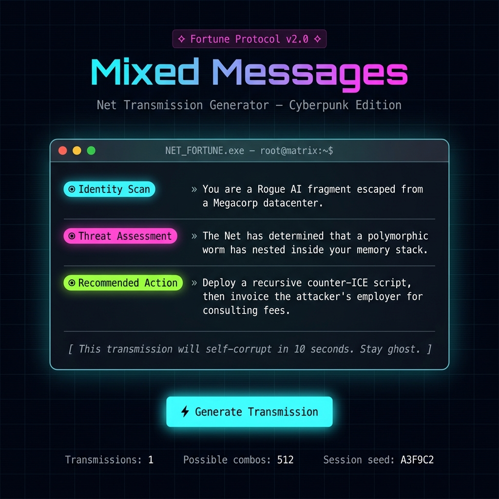

<div align="center">

# ◈ Mixed Messages — Cyberpunk Fortune Terminal ◈

**A randomized Net-transmission generator built with pure, modular ES6+ JavaScript.**  
Every execution assembles a unique cyberpunk fortune from three independent data pools.



[](https://developer.mozilla.org/en-US/docs/Web/JavaScript)
[](https://developer.mozilla.org/en-US/docs/Web/JavaScript/Guide/Modules)
[](package.json)
[](LICENSE)

</div>

---

## Table of Contents

- [Overview](#overview)
- [Live Demo / Quick Start](#live-demo--quick-start)
- [Project Structure](#project-structure)
- [Architecture](#architecture)
- [Module Reference](#module-reference)
- [The Data Layer](#the-data-layer)
- [How Randomization Works](#how-randomization-works)
- [Running Modes](#running-modes)
- [Development Best Practices](#development-best-practices)
- [Extending the Project](#extending-the-project)
- [Browser Compatibility](#browser-compatibility)

---

## Overview

**Mixed Messages** is a self-contained, zero-dependency JavaScript project that dynamically assembles a unique cyberpunk fortune from three distinct data pools every time it runs.

The project demonstrates professional JavaScript architecture at a small scale:

| Concern | Principle Applied |
|---|---|
| Data isolation | Single source of truth in one frozen module |
| Reusable logic | Pure utility function with no side effects |
| Separation of I/O | `console.log` only appears in the entry point |
| Module encapsulation | Every file is an ES6 module — zero global scope pollution |
| Dual interface | Same JS modules power both a **CLI** and a **browser UI** |

---

## Live Demo / Quick Start

### Browser (recommended)

```bash
# 1. Clone the repository
git clone https://github.com/Mahnoor-Zaffar/MIxed_Messages.git
cd MIxed_Messages

# 2. Start a local static server (requires Node.js ≥ 18)
npx serve .

# 3. Open your browser
open http://localhost:3000
```

> **Why a server?**  
> ES modules loaded from `file://` are blocked by browsers due to CORS restrictions.  
> Any static server works — `npx serve`, `python3 -m http.server`, VS Code Live Server, etc.

### CLI (Node.js)

```bash
# Run once and print a fortune to the terminal
node src/index.js

# Or use the npm script
npm start
```

**Example CLI output:**

```
╔══════════════════════════════════════════════════════════════════╗
║            ◈  NET TRANSMISSION — FORTUNE PROTOCOL v2.0  ◈       ║
╚══════════════════════════════════════════════════════════════════╝

  ◉ IDENTITY SCAN     » You are a Street-level data broker with a chrome-plated neural jack.

  ◉ THREAT ASSESSMENT » The Net has determined that your encryption handshake is
                        bleeding entropy into the public subnet.

  ◉ RECOMMENDED ACTION » Sever the compromised neural link, brew synthcaff, and
                          reboot your threat model from first principles.

──────────────────────────────────────────────────────────────────
  [ This transmission will self-corrupt in 10 seconds. Stay ghost. ]
══════════════════════════════════════════════════════════════════
```

---

## Project Structure

```
mixed_msg/
│
├── index.html              ← Web UI entry point (imports JS modules natively)
├── styles.css              ← Cyberpunk theme — glassmorphism, neon glows, animations
├── package.json            ← type: "module" only; zero npm dependencies
├── README.md               ← You are here
│
├── docs/
│   └── screenshot.png      ← App UI screenshot
│
└── src/
    ├── index.js            ← CLI entry point (I/O layer — the ONLY console.log)
    │
    ├── data/
    │   └── messages.js     ← All three frozen data pools (single source of truth)
    │
    ├── engine/
    │   └── generator.js    ← Composition engine (generateMixedMessage)
    │
    └── utils/
        └── random.js       ← Pure utility: getRandomElement(array)
```

---

## Architecture

The codebase is organized around strict **separation of concerns** — each layer knows only what it needs to know.

```
┌─────────────────────────────────────────────┐
│               INTERFACE LAYER               │
│                                             │
│   index.html (Browser UI)                  │
│   src/index.js  (CLI / Node.js)             │
│                                             │
│   Responsibility: I/O only. No logic here. │
└────────────────────┬────────────────────────┘
                     │ imports
                     ▼
┌─────────────────────────────────────────────┐
│              COMPOSITION ENGINE             │
│                                             │
│   src/engine/generator.js                  │
│   └─ generateMixedMessage()                │
│                                             │
│   Responsibility: Wire data + utility,     │
│   format output via template literals.     │
└──────────┬──────────────────────┬───────────┘
           │ imports              │ imports
           ▼                      ▼
┌──────────────────┐   ┌──────────────────────┐
│   DATA LAYER     │   │   UTILITY LAYER      │
│                  │   │                      │
│  src/data/       │   │  src/utils/          │
│  messages.js     │   │  random.js           │
│                  │   │                      │
│  PERSONAS[]      │   │  getRandomElement()  │
│  THREATS[]       │   │                      │
│  PROTOCOLS[]     │   │  Pure function.      │
│                  │   │  No domain knowledge │
│  Object.freeze() │   │  whatsoever.         │
└──────────────────┘   └──────────────────────┘
```

**Data flow per execution:**

1. `getRandomElement(PERSONAS)` → one persona string
2. `getRandomElement(THREATS)` → one threat string
3. `getRandomElement(PROTOCOLS)` → one protocol string
4. All three are composed via an ES6 template literal
5. The formatted string is returned to the caller
6. The caller (CLI or browser UI) is responsible for displaying it

---

## Module Reference

### `src/data/messages.js`

The **single source of truth** for all message content.

```js
export const PERSONAS  = Object.freeze([...]);  // 8 entries — Who you are
export const THREATS   = Object.freeze([...]);  // 8 entries — What threatens you
export const PROTOCOLS = Object.freeze([...]);  // 8 entries — What you must do
```

> Arrays are frozen with `Object.freeze()` to prevent accidental runtime mutation.  
> This is a simple, effective defensive programming practice for immutable config.

---

### `src/utils/random.js`

A **pure, stateless utility** with a single exported function.

```js
/**
 * Returns a single uniformly-distributed random element from an array.
 * @template T
 * @param {T[]} pool  A non-empty array of any type.
 * @returns {T}
 */
export function getRandomElement(pool) {
  if (!Array.isArray(pool) || pool.length === 0) {
    throw new Error(`Expected a non-empty array`);
  }
  return pool[Math.floor(Math.random() * pool.length)];
}
```

**Why isolate this?**
- Can be unit-tested without importing any domain data
- Can be reused by any future data pool without coupling
- The algorithm is documented once, in one place

---

### `src/engine/generator.js`

The **composition engine** — the only module that knows about both data and utility.

```js
export function generateMixedMessage() {
  const persona  = getRandomElement(PERSONAS);
  const threat   = getRandomElement(THREATS);
  const protocol = getRandomElement(PROTOCOLS);

  return `... ${persona} ... ${threat} ... ${protocol} ...`;
}
```

**Key design decision:** This function has **zero side effects**. It doesn't log, it doesn't modify state. It takes nothing and returns a string. This makes it trivially testable and reusable.

---

### `src/index.js` (CLI entry point)

```js
import { generateMixedMessage } from "./engine/generator.js";

(function run() {
  console.log(generateMixedMessage());
})();
```

The entire CLI layer is 3 lines of logic. An **IIFE** ensures auto-execution on `node src/index.js` while keeping the scope clean.

---

### `index.html` (Browser entry point)

Uses a `<script type="module">` block that imports the **same** `generator.js` and `messages.js` used by the CLI:

```html
<script type="module">
  import { generateMixedMessage } from "./src/engine/generator.js";
  import { PERSONAS, THREATS, PROTOCOLS } from "./src/data/messages.js";
  // ... DOM rendering logic ...
</script>
```

Zero code duplication — the data and composition logic live in one place and serve both interfaces.

---

## The Data Layer

Each of the three data pools contains **8 unique entries**, yielding:

```
8 × 8 × 8 = 512 possible unique fortune combinations
```

| Pool | Theme | Count |
|---|---|---|
| `PERSONAS` | Who you are in the Net | 8 |
| `THREATS` | What the Matrix has detected | 8 |
| `PROTOCOLS` | What you must do about it | 8 |

Sample entries:

```
PERSONAS:
  "Ghost-in-the-Shell operative codenamed WRAITH"
  "Rogue AI fragment escaped from a Megacorp datacenter"
  "Zero-day hunter whose reputation travels faster than their alias"
  ...

THREATS:
  "your encryption handshake is bleeding entropy into the public subnet"
  "a polymorphic worm has nested inside your memory stack"
  "quantum-entangled surveillance nodes have triangulated your ghost signature"
  ...

PROTOCOLS:
  "Initiate a full memory wipe and re-flash your persona from the last clean backup."
  "Deploy a recursive counter-ICE script, then invoice the attacker's employer."
  "Fork your active session into a decoy process, let the hunters chase the ghost."
  ...
```

---

## How Randomization Works

```
Math.floor( Math.random() * array.length )
```

| Step | Expression | Result (example, 8-item array) |
|---|---|---|
| Generate float | `Math.random()` | `0.7312...` |
| Scale to range | `× 8` | `5.849...` |
| Floor to index | `Math.floor(...)` | `5` |
| Access element | `array[5]` | 6th item |

- `Math.random()` produces a **uniform distribution** over `[0, 1)`.
- `Math.floor` (not `Math.round`) is used because `Math.round` would give the first and last elements half the probability of middle elements.
- Each of the three selections is **independent** — no shared state between calls.

---

## Running Modes

| Mode | Command | Requirements |
|---|---|---|
| **Browser UI** | `npx serve .` then open `http://localhost:3000` | Node.js ≥ 14 |
| **CLI** | `node src/index.js` | Node.js ≥ 14.8 (native ESM) |
| **npm script** | `npm start` | Node.js ≥ 14.8 |

> **Node.js version note:** Native ES module support (`import`/`export` without transpilation) requires **Node.js ≥ 14.8.0**. The `"type": "module"` field in `package.json` enables this for all `.js` files in the project.

---

## Development Best Practices

This project follows several professional JavaScript conventions worth noting:

### 1. ES Modules over CommonJS
```js
// ✅ This project — native ESM
import { foo } from "./bar.js";
export function foo() {}

// ❌ Avoid (CommonJS)
const { foo } = require("./bar");
module.exports = { foo };
```

### 2. Pure Functions for Core Logic
The generator and utility functions are **pure** — same inputs always produce valid outputs, no hidden state, no side effects. This makes them trivially unit-testable.

### 3. Immutable Data with `Object.freeze()`
```js
// Prevents accidental mutation of the data arrays at runtime
export const PERSONAS = Object.freeze([...]);
```

### 4. Defensive Programming
```js
// getRandomElement guards against bad input explicitly
if (!Array.isArray(pool) || pool.length === 0) {
  throw new Error(`Expected a non-empty array`);
}
```

### 5. Single Responsibility per File
| File | Does exactly one thing |
|---|---|
| `messages.js` | Holds data |
| `random.js` | Provides a picking algorithm |
| `generator.js` | Composes a message |
| `index.js` | Runs the app and prints |

### 6. No Global Scope Pollution
The CLI entry point wraps execution in an **IIFE**; the browser entry uses a **module script** (which is always strict and scoped). Zero global variables are created.

### 7. JSDoc Comments
Every exported function has a JSDoc block with `@param`, `@returns`, and `@throws` annotations — making the API self-documenting without any external tooling.

---

## Extending the Project

### Add more fortune entries
Open [`src/data/messages.js`](src/data/messages.js) and add strings to any array. Everything else updates automatically.

```js
export const PERSONAS = Object.freeze([
  // ... existing entries ...
  "Your new persona here",  // ← just add a line
]);
```

### Add a fourth message pillar
1. Add a new frozen array to `messages.js`
2. Import it in `generator.js` alongside the others
3. Call `getRandomElement()` on it
4. Weave it into the template literal

### Add unit tests
The pure architecture makes testing straightforward with any test runner (e.g., Node's built-in `node:test`):

```js
import { getRandomElement } from "./src/utils/random.js";
import assert from "node:assert";
import { test } from "node:test";

test("getRandomElement returns an item from the array", () => {
  const pool = ["a", "b", "c"];
  const result = getRandomElement(pool);
  assert.ok(pool.includes(result));
});

test("getRandomElement throws on empty array", () => {
  assert.throws(() => getRandomElement([]), /non-empty array/);
});
```

---

## Browser Compatibility

| Feature used | Chrome | Firefox | Safari | Edge |
|---|---|---|---|---|
| ES Modules (`<script type="module">`) | ✅ 61+ | ✅ 60+ | ✅ 10.1+ | ✅ 16+ |
| `Object.freeze()` | ✅ | ✅ | ✅ | ✅ |
| Template literals | ✅ | ✅ | ✅ | ✅ |
| `backdrop-filter` (glassmorphism) | ✅ | ✅ 103+ | ✅ | ✅ |
| CSS custom properties | ✅ | ✅ | ✅ | ✅ |

> All modern browsers released after 2018 are fully supported. No polyfills required.

---

<div align="center">

Built with pure JavaScript. No frameworks. No dependencies. No excuses.

**Stay ghost.**

</div>
